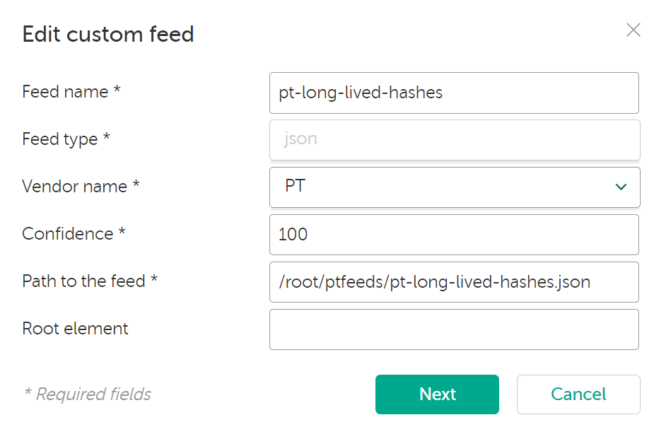
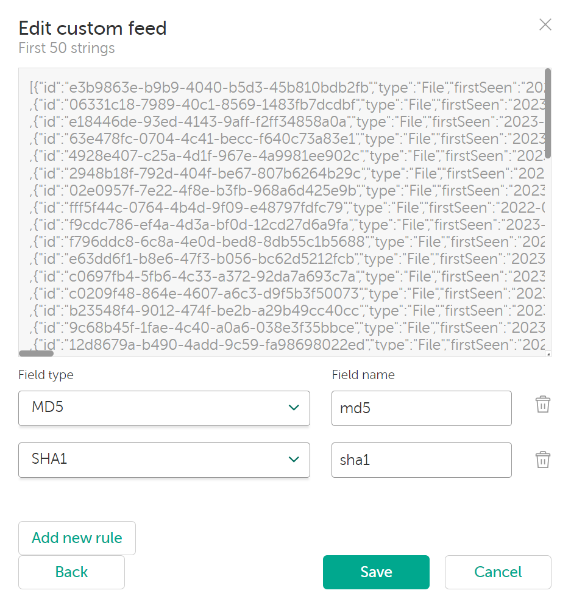

# How to connect Positive Technologies data feeds to Kaspersky CyberTrace TI Platform
Kindly change the API key, absolute paths, and root user to your own credentials for enhanced security and precise configuration.

1. Create a directory for the downloader script and data feed storage
```
mkdir /root/ptfeeds
cd /root/ptfeeds
```
2. Retrieve the downloader script, modify permissions, and execute it for testing.
```
wget https://raw.githubusercontent.com/kmssrv/SecOpsClub/master/Data%20Feeds/Kaspersky%20CyberTrace%20%2B%20Positive%20Technologies%20Data%20Feeds/pt-feeds-downloader.sh
chmod +x pt-feeds-downloader.sh
./pt-feeds-downloader.sh
```
3. Verify if the data feed JSON file is valid.
```
ls -ll

-rw-r--r--. 1 root root   53709764 Oct 19 17:41 pt-long-lived-domains.json
-rw-r--r--. 1 root root 2271226296 Oct 19 18:15 pt-long-lived-hashes.json
-rw-r--r--. 1 root root   12197016 Oct 19 17:08 pt-long-lived-ips.json
-rw-r--r--. 1 root root  460642415 Oct 20 00:06 pt-long-lived-urls.json
-rw-r--r--. 1 root root          2 Oct 20 12:06 pt-short-lived-domains.json
-rw-r--r--. 1 root root   53682235 Oct 20 11:58 pt-short-lived-hashes.json
-rw-r--r--. 1 root root     124821 Oct 20 12:07 pt-short-lived-ips.json
-rw-r--r--. 1 root root    5075360 Oct 20 11:56 pt-short-lived-urls.json
```
```
pt-short-lived-ips.json | jq '.[].value'
"23.128.248.17"
"185.56.171.94"
"185.189.12.192"
"154.9.226.59"
...
```
4. Go to Kaspersky CyberTrace web console -> Settings -> Feeds -> Add custom feed.

Step 1:



Step 2:


