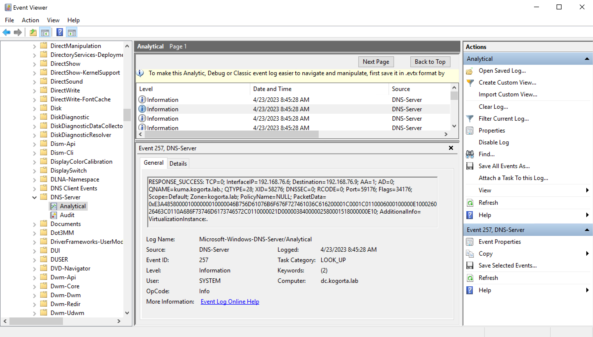
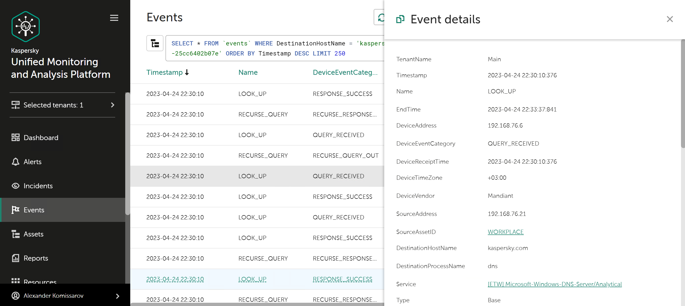

# Windows DNS Server logging overview

## DNS logging via ETW providers

Enhanced Windows DNS Event Log logging is available from Event Tracing for Windows providers. There are two event categories:
1. Windows DNS Server Audit Events
2. Windows DNS Server Analytical Events
The main advantage of using this method is that ETW events can be read directly without requiring events to be first written to disk.
The article discusses the steps and settings required for configuring the transmission of analytical events in a SIEM solution, including event forwarding and related configurations.

## File-based DNS debug logging
The commonly used method to obtain transaction information from a Windows DNS Server is by using the log file. The technical details will not be considered in this article.

# Windows DNS Server preparation

## Enable DNS audit and analytic logging
Follow the steps in the manual:
https://learn.microsoft.com/en-us/previous-versions/windows/it-pro/windows-server-2012-R2-and-2012/dn800669(v=ws.11)

## Check logging configuration
If the configuration is OK, then the ETL log analytics will be available in the Windows Event Viewer.

# Install Collector

## KUMA 2.1
In order to collect Windows DNS analytic events, you need to install an HTTP collector. This process is typically straightforward. The demo resources `[KUMARES][KMSSRV]ETW_DNS` , including collector configuration and normalizer, are available for testing and demonstration purposes. You will just need to add destinations: correlator, storage, etc.

**_NOTE:_**  KUMA resources password is Kmssrv!1

# Install SilkService
1. Download and extract the service executable files from https://github.com/mandiant/SilkETW/releases, for example, to the `C:\` directory.
2. Replace config file with SilkServiceConfig.xml.
3. Replace IP and port of KUMA with your own.
4. Install service
```
sc create SilkService binPath= "C:\SilkService\SilkService.exe" start=demand
```
5. Change startup options if needed and start the service.
6. Check log in `C:\SilkService\Logs\ServiceLog_*`
```
[+] SilkService started at: 4/24/2023 6:22:28 AM
[+] Collector ID: 8eb39099-118f-4a72-a2d0-05a961e11990; Parameter validation success
[*] Starting collector threads: 4/24/2023 6:22:28 AM
    [+] GUID:     8eb39099-118f-4a72-a2d0-05a961e11990
    [>] Type:     User
    [>] Provider: EB79061A-A566-4698-9119-3ED2807060E7
    [>] Out Type: url
[+] Collector ID: 8eb39099-118f-4a72-a2d0-05a961e11990; Starting trace collector
```

# Check events
## KUMA 2.1
Navigate to the collector events, and you will find analytical events from Windows DNS Server.

# Known issues
If the KUMA collector is stopped, the Silk service will also stop and will not auto-start after the KUMA collector is run.

# References
#### Collect logs from Windows DNS Server
https://docs.nxlog.co/userguide/integrate/dns-monitoring-windows.html#collecting-dns-server-analytical-logs
#### Using server debug logging options
https://learn.microsoft.com/en-us/previous-versions/windows/it-pro/windows-server-2003/cc776361(v=ws.10)
#### Select and enable debug logging options on the DNS server
https://learn.microsoft.com/en-us/previous-versions/windows/it-pro/windows-server-2003/cc759581(v=ws.10) 